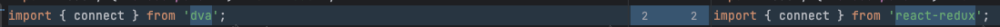

---
group:
  title: 其他
  order: 4
title: createReduxSagas dva伪装器
---

<h2>createReduxSagas</h2>

<h3>简介</h3>
<div>伪装成dva实现部分功能，可以方便读取model</div>

<h3>背景</h3>
<div>项目中大量使用dva，而umi项目中dva是和umi结合在一起的，组件或页面导出的时候需要剔除umi，导致无法加载models，dva也就无法使用，导致项目中使用dva的所有逻辑都存在问题。如果无法解决dva的问题，输出组件或者页面给外部项目使用时，需要改造大量代码，成本极高、风险极大。</div>

<h3>代码演示</h3>

<div>step1: 新建store</div>
<br/>

```jsx | pure
import { createStore, applyMiddleware } from 'redux';
import createSagaMiddleware from 'redux-saga';
import { createReduxSagas } from '@dm/xman-packages';
const sagaMiddleware = createSagaMiddleware();
import GlobalModel from './models/global';
import TaskModel from './pages/task/models/TaskSaga';

// 导入dva的model
const { rootReducer, rootSaga } = createReduxSagas([GlobalModel, TaskModel]);

const store = createStore(rootReducer, applyMiddleware(sagaMiddleware));

sagaMiddleware.run(rootSaga);

export default store;
```

<br/>
<div>step2: 导入store</div>
<br/>

```jsx | pure
import React, { useEffect } from 'react';
import { Provider, useDispatch } from 'react-redux';

import store from '../store.js';

import Layout from '../layouts/index.js';

const StoreWrapper = (props) => {
  const dispatch = useDispatch();
  return (
    {/**设置store**/}
    <Provider store={store}>
      {/**设置dispatch**/}
      <Layout dispatch={dispatch}>{children}</Layout>
    </Provider>
  );
};

export default StoreWrapper;
```

<br/>
<div>step3: 改造代码</div>
<br/>


<br/>
<br/>
<div>webpack.config.js配置信息</div>
<br/>

```jsx | pure
const path = require('path');
const MiniCssExtractPlugin = require('mini-css-extract-plugin');
const TerserPlugin = require('terser-webpack-plugin');
const webpack = require('webpack');
const { CleanWebpackPlugin } = require('clean-webpack-plugin');
const CssMinimizerPlugin = require('css-minimizer-webpack-plugin');
const BundleAnalyzerPlugin = require('webpack-bundle-analyzer').BundleAnalyzerPlugin;
const LodashWebpackPlugin = require('lodash-webpack-plugin');
const OptimizeCSSAssetsPlugin = require('optimize-css-assets-webpack-plugin');

module.exports = {
  mode: 'production',
  entry: './src/index.ts',
  // 生成一个外部的source map文件，只提供了行数信息，但是打包速度较快
  devtool: 'cheap-source-map',
  output: {
    path: path.resolve(__dirname, 'dist'),
    publicPath: './',
    filename: 'index.js',
    libraryTarget: 'umd',
    library: '@dm/reach-components',
  },
  externals: {
    react: {
      commonjs: 'react',
      commonjs2: 'react',
      amd: 'react',
      root: 'React',
    },
    'react-dom': {
      commonjs: 'react-dom',
      commonjs2: 'react-dom',
      amd: 'react-dom',
      root: 'ReactDOM',
    },
  },
  resolve: {
    alias: {
      '@': path.resolve(__dirname, 'src'),
      '@common': path.resolve(__dirname, 'src/common'),
      '@less': path.resolve(__dirname, 'src/less'),
      utils: path.resolve(__dirname, 'utils'),
      '@contants': path.resolve(__dirname, 'src/constants'),
      'react/jsx-runtime': require.resolve('react/jsx-runtime'),
    },
    extensions: ['.ts', '.tsx', '.js', '.jsx'],
  },
  module: {
    rules: [
      {
        test: /\.(ts|tsx)?$/,
        use: [
          {
            loader: 'babel-loader',
            options: {
              configFile: './build.babel.config.js', // 指定Babel配置文件的路径
            },
          },
          {
            loader: 'ts-loader',
            options: {
              // transpileOnly: true,
            },
          },
        ],
        exclude: /node_modules/,
      },
      {
        test: /\.(js|jsx)?$/,
        use: [
          {
            loader: 'babel-loader',
            options: {
              configFile: './build.babel.config.js', // 指定Babel配置文件的路径
            },
          },
        ],
        exclude: /node_modules/,
      },
      // antd 样式配置
      {
        test: /\.less$/,
        include: /node_modules/,
        use: [
          MiniCssExtractPlugin.loader,
          {
            loader: 'css-loader',
            options: {
              modules: false,
              sourceMap: true,
            },
          },
          {
            loader: 'less-loader',
            options: {
              lessOptions: {
                sourceMap: true,
                javascriptEnabled: true,
                modifyVars: {
                  '@primary-color': '#00BC70',
                  '@ant-prefix': 'ant-xman',
                },
              },
            },
          },
        ],
      },
      {
        test: /\.css$/,
        use: [
          MiniCssExtractPlugin.loader,
          {
            loader: 'css-loader',
            options: {
              sourceMap: true,
              modules: {
                localIdentName: '[local]__[hash:base64:5]',
                exportLocalsConvention: 'camelCase',
                auto: true,
              },
            },
          },
        ],
      },
      // 自定义样式配置
      {
        test: /\.less$/,
        exclude: [/node_modules/],
        oneOf: [
          {
            resourceQuery: /css_modules/,
            use: [
              MiniCssExtractPlugin.loader,
              {
                loader: 'css-loader',
                options: {
                  modules: {
                    localIdentName: '[local]__[hash:base64:5]',
                    exportLocalsConvention: 'camelCase',
                  },
                  sourceMap: true,
                },
              },
              {
                loader: 'less-loader',
                options: {
                  sourceMap: true,
                  lessOptions: {
                    modifyVars: {},
                    // javascriptEnabled: true,
                  },
                },
              },
            ],
          },
          {
            use: [
              MiniCssExtractPlugin.loader,
              {
                loader: 'css-loader',
              },
              {
                loader: 'less-loader',
              },
            ],
          },
        ],
      },
      {
        test: /\.(png|jpe?g|gif|svg|woff2?|eot|ttf|otf)$/i,
        use: [
          {
            loader: 'file-loader',
            options: {
              name: `[name].[contentHash].[ext]`,
              outputPath: 'assets',
              publicPath: 'https://xmanstatic.zhongan.io/finance_sdk/img/',
              esModule: false,
            },
          },
        ],
      },
    ],
  },
  plugins: [
    new webpack.ProvidePlugin({
      React: 'react',
      ReactDOM: 'react-dom',
    }),
    new CleanWebpackPlugin(),
    new MiniCssExtractPlugin({
      filename: 'style.css',
    }),
    new BundleAnalyzerPlugin(),
    new LodashWebpackPlugin(),
  ],
  optimization: {
    minimizer: [
      new CssMinimizerPlugin(),
      new TerserPlugin({
        terserOptions: {
          output: {
            // 移除注释
            comments: false,
          },
        },
        // 移除授权信息
        extractComments: false,
        parallel: true,
      }),
      new OptimizeCSSAssetsPlugin(),
    ],
  },
  target: ['web', 'es5'],
};
```

<br/>
<br/>
<div>babel配置</div>
<br/>

```jsx | pure
//babel.css.module.js
const { extname } = require('path');
const CSS_EXTNAMES = ['.css', '.sass', '.less'];
module.exports = () => {
  return {
    visitor: {
      ImportDeclaration(path) {
        const { specifiers, source } = path.node;
        const { value } = source;
        if (specifiers.length > 0 && CSS_EXTNAMES.includes(extname(value))) {
          source.value = `${value}?css_modules`; // 在路径末尾加上 css_modules 用于 webpack 匹配该文件，如 import Test from './test.less'; 变成 import Test from './test.less?css_modules';
        }
      },
    },
  };
};
```

```jsx | pure
//build.babel.config
module.exports = {
  presets: [
    ['@babel/preset-env', { modules: false, useBuiltIns: 'usage' }],
    '@babel/preset-react',
    '@babel/preset-typescript',
  ],
  plugins: [
    ['import', { libraryName: 'antd', libraryDirectory: 'es', style: true }],
    ['transform-remove-console'],
    ['transform-remove-debugger'],
    './babel.css.module',
  ],
};
```

<a href="https://www.yuque.com/yuqueyonghuza4x0r/qd1rig/lxt1h3exmsgk31rn?singleDoc#" target="_blank">umi 项目代码拆分为组件输出方案</a>
