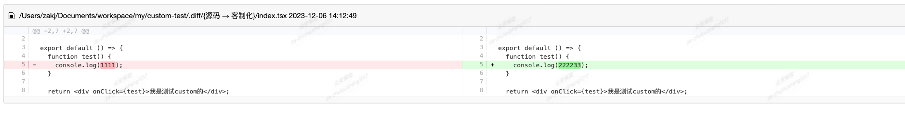

---
group:
  title: 其他
  order: 4
title: custom 客制化工具
---

<h2>@dm/custom-cli</h2>

<h3>简介</h3>
<div>客制化工具，应用在基于现有代码做二次开发，并且现有代码可能有变更的情况。提供代码修改后的对比功能</div>

```jsx | pure

npm install @dm/custom-cli -g

custom dev  //本地开发执行
custom build //打包编译
custom diff //对比服务
custom init //初始化客制化

```

<a href="https://www.yuque.com/yuqueyonghuza4x0r/qd1rig/mhmhqay5nhf1br3q?singleDoc#" target="_blank">前端项目客制化</a>

<h3>效果展示</h3>
custom diff

